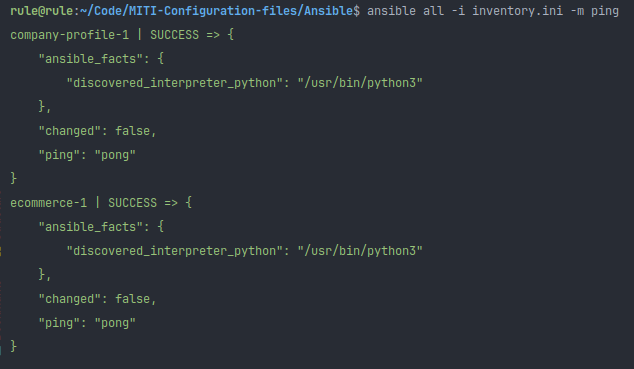
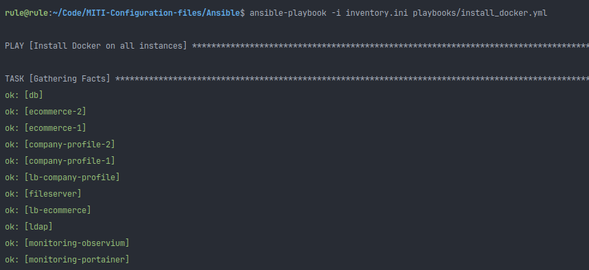
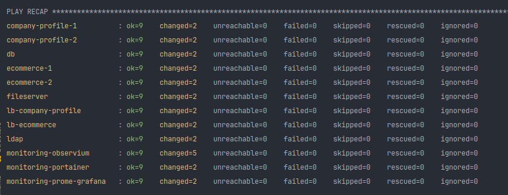

# Tutorial Menggunakan Ansible

## Daftar Konten

1. [Apa itu Ansible?](#apa-itu-ansible)
2. [Prasyarat](#prasyarat)
3. [Instalasi Ansible](#instalasi-ansible)
4. [Struktur Direktori Ansible](#struktur-direktori-ansible)
5. [Menyiapkan Inventory Ansible](#menyiapkan-inventory-ansible)
6. [Menguji Koneksi ke Host](#menguji-koneksi-ke-host)
7. [Menulis Playbook Ansible](#menulis-playbook-ansible)
8. [Menjalankan Playbook](#menjalankan-playbook)

## Apa itu Ansible?


Ansible adalah sebuah platform perangkat lunak open-source yang digunakan untuk otomatisasi tugas-tugas IT seperti penyebaran aplikasi, manajemen konfigurasi, manajemen perangkat lunak, dan orkestrasi infrastruktur. Ini memungkinkan para administrator sistem untuk menyediakan, mengotomatisasi, dan mengelola infrastruktur IT mereka dengan lebih efisien melalui pendekatan berbasis kode (code-based) yang mudah dibaca dan dipelajari.

## Prasyarat

- Python
- SSH
- Linux atau MacOS (Jika menggunakan Windows, gunakan WSL atau Docker)

## Instalasi Ansible
- Jalankan perintah berikut untuk menyertakan PPA (personal package archive) resmi proyek ke dalam daftar sumber sistem Anda:
    
    ```sh
    sudo apt-add-repository ppa:ansible/ansible
    ```

    Tekan ENTER ketika diminta untuk menerima penambahan PPA.

- Selanjutnya, perbarui indeks paket sistem Anda sehingga mengetahui paket yang tersedia dalam PPA yang baru disertakan:
    
    ```sh
    sudo apt update -y
    ```

- Setelah pembaruan ini, Anda dapat menginstal perangkat lunak Ansible dengan:
    
    ```sh
    sudo apt install ansible -y
    ```

- Setelah instalasi selesai, Anda dapat memeriksa versi Ansible yang diinstal dengan menjalankan perintah berikut:
    
    ```sh
    ansible --version
    ```

Node kontrol Ansible Anda sekarang memiliki semua perangkat lunak yang diperlukan untuk mengelola host Anda. Selanjutnya, kita akan membahas cara menambahkan host Anda ke file inventory node kontrol sehingga dapat mengendalikan mereka.

## Struktur Direktori Ansible
Struktur direktori yang terorganisir dengan baik untuk menjalankan playbook Ansible dapat membantu dalam pengelolaan dan pemeliharaan skrip. Berikut adalah contoh struktur direktori yang dapat Anda gunakan:

```
ansible/
├── ansible.cfg
├── inventory.ini
└── playbooks/
    └── install_docker.yml
```

Berikut adalah detail dari masing-masing file dan direktori:

1. **inventory.ini**: Berisi daftar host dan variabel yang diperlukan untuk koneksi.
2. **ansible.cfg**: Berisi konfigurasi Ansible.
3. **playbooks/**: Direktori untuk menyimpan playbook Ansible.

## Menyiapkan Inventory Ansible

Inventory Ansible adalah daftar host yang akan dikelola oleh Ansible. Anda dapat menambahkan host ke file inventory dengan cara berikut:

```ini
# /etc/ansible/hosts
[webservers]
web1.example.com
web2.example.com

[dbservers]
db1.example.com
db2.example.com
```

Anda juga dapat menggunakan IP address jika host Anda tidak memiliki nama domain. Contoh untuk kasus ini:

```ini
[all]
company-profile-1 ansible_host=34.42.61.213
company-profile-2 ansible_host=34.66.223.250
db ansible_host=34.171.248.255
ecommerce-1 ansible_host=34.173.216.13
ecommerce-2 ansible_host=104.197.47.241
fileserver ansible_host=34.69.129.247
lb-company-profile ansible_host=34.72.169.255
lb-ecommerce ansible_host=34.132.63.81
ldap ansible_host=35.188.65.199
monitoring-observium ansible_host=34.133.240.73
monitoring-portainer ansible_host=34.72.244.158
monitoring-prome-grafana ansible_host=35.222.231.101

[company_profile]
company-profile-1
company-profile-2

[ecommerce]
ecommerce-1
ecommerce-2

[db_service]
db

[fileserver_service]
fileserver

[lb]
lb-company-profile
lb-ecommerce

[monitoring_observium_service]
monitoring-observium

[monitoring_portainer_service]
monitoring-portainer

[monitoring_prome_grafana_service]
monitoring-prome-grafana

[ldap_service]
ldap

[node_exporter]
company-profile-1
company-profile-2
ecommerce-1
ecommerce-2
db
fileserver
lb-company-profile
lb-ecommerce
ldap
monitoring-observium
monitoring-portainer

[snmp]
company-profile-1
company-profile-2
ecommerce-1
ecommerce-2
db
fileserver
lb-company-profile
lb-ecommerce
ldap
monitoring-portainer
monitoring-prome-grafana

[portainer_agent]
company-profile-1
company-profile-2
ecommerce-1
ecommerce-2
db
fileserver
lb-company-profile
lb-ecommerce
ldap
monitoring-observium
monitoring-prome-grafana

[all:vars]
ansible_user=apriansyah_syahrul
ansible_ssh_private_key_file=/home/rule/.ssh/id_ed25519
```

Setelah Anda menambahkan host ke file inventory, Anda dapat membuat file `ansible.cfg` di direktori kerja Anda untuk menentukan konfigurasi Ansible. Berikut adalah contoh isi file `ansible.cfg`:
```cfg
[defaults]
inventory = ./inventory.ini
remote_user = apriansyah_syahrul
private_key_file = /home/rule/.ssh/id_ed25519
host_key_checking = False

[privilege_escalation]
become = True

[ssh_connection]
ssh_args = -o StrictHostKeyChecking=no
```

Penjelasan dari konfigurasi di atas:
- `inventory`: Menentukan file inventory yang akan digunakan oleh Ansible.
- `remote_user`: Menentukan pengguna SSH yang akan digunakan oleh Ansible untuk menghubungkan ke host.
- `private_key_file`: Menentukan file kunci SSH yang akan digunakan oleh Ansible untuk menghubungkan ke host.
- `host_key_checking`: Menentukan apakah Ansible akan memeriksa kunci host SSH saat menghubungkan ke host.
- `privilege_escalation`: Menentukan apakah Ansible akan menggunakan privilege escalation (sudo) saat menjalankan tugas.
- `ssh_connection`: Menentukan opsi SSH tambahan yang akan digunakan oleh Ansible saat menghubungkan ke host. `StrictHostKeyChecking=no` menonaktifkan verifikasi kunci host SSH.


## Menguji Koneksi ke Host

Setelah Anda menambahkan host ke file inventory dan mengonfigurasi Ansible, Anda dapat menguji koneksi ke host dengan perintah berikut (Pastikan anda saat ini berada di direktori yang berisi file `ansible.cfg`)

```sh
ansible all -i inventory.ini -m ping
```

Jika konfigurasi Anda benar, Anda akan melihat hasil yang menunjukkan bahwa setiap host merespons dengan "pong".


## Menulis Playbook Ansible

Playbook Ansible adalah file YAML yang berisi satu atau lebih 'plays', yang menentukan tugas yang akan dijalankan pada host yang ditentukan. Berikut adalah contohnya:

### `playbooks/install_docker.yml`
```yaml
- name: Install Docker on all instances
  hosts: all
  become: true
  tasks:
    - name: Uninstall old versions
      apt:
        name:
          - docker
          - docker-engine
          - docker.io
          - containerd
          - runc
        state: absent
        autoremove: true
      become: true

    - name: Update all packages using the apt repository
      apt:
        update_cache: yes
        force_apt_get: yes
      become: true

    - name: Upgrading all apt packages using apt
      apt:
        force_apt_get: yes
        upgrade: yes
      become: true

    - name: Install packages
      apt:
        name:
          - ca-certificates
          - curl
          - gnupg
        state: present
      become: true

    - name: Add Docker official GPG key
      apt_key:
        url: https://download.docker.com/linux/ubuntu/gpg

    - name: Add Docker Repository
      apt_repository:
        repo: deb [arch=amd64] https://download.docker.com/linux/ubuntu focal stable
        state: present

    - name: Update all packages using the apt repository
      apt:
        update_cache: yes
        force_apt_get: yes
      become: true

    - name: Install Docker Engine
      apt:
        name:
          - docker-ce
          - docker-ce-cli
          - containerd.io
          - docker-buildx-plugin
          - docker-compose-plugin
        state: present

```

### Menjalankan Playbook

Setelah struktur direktori siap, Anda dapat menjalankan playbook dengan perintah berikut:
```bash
ansible-playbook -i inventory.ini playbooks/install_docker.yml
```

Hasilnya akan menunjukkan proses instalasi Docker pada semua host yang terdaftar di file inventory. 

Dan Hasil akhirnya akan seperti ini:


## Contoh Playbook Ansible Lainnya

Berikut adalah contoh playbook Ansible lainnya yang dapat Anda gunakan:
### Clone Repository dari GitHub
```yaml
- name: Install git and clone/pull repository on all instances
  hosts: all
  become: true
  tasks:
    - name: Update all packages using the apt repository
      apt:
        update_cache: yes
      become: true

    - name: Install git
      apt:
        name: git
        state: present
      become: true

    - name: Ensure the destination directory exists
      file:
        path: '/home/apriansyah_syahrul/Mitigas'
        state: directory
        mode: '0755'
      become: true

    - name: Clone or pull the MITI-Configuration-files repository
      git:
        repo: 'https://github.com/SyahrulApr86/MITI-Configuration-files.git'
        dest: '/home/apriansyah_syahrul/Mitigas'
        version: 'HEAD'
        force: yes
      become: true

```
Pastikan destination directory sesuai dengan yang Anda inginkan. Anda juga dapat mengganti `repo` dengan URL repository yang ingin Anda clone.
```bash
ansible-playbook -i inventory.ini playbooks/clone_repository.yml
```

### Docker Compose Up
```yaml
- name: Run docker compose up on [host] instances
  hosts: host_yang_ingin_diinstall
  become: true
  tasks:
    - name: Change to Docker Compose directory
      command: chdir=/lokasi/direktori/docker-compose
      args:
        chdir: /lokasi/direktori/docker-compose

    - name: Run docker compose up
      command: docker compose up -d
      args:
        chdir: /lokasi/direktori/docker-compose
```
Pastikan Anda mengganti `host_yang_ingin_diinstall` dengan nama host yang ingin Anda install. Anda juga perlu mengganti `/lokasi/direktori/docker-compose` dengan lokasi direktori yang berisi file `docker-compose.yml`.
```bash
ansible-playbook -i inventory.ini playbooks/docker_compose_up.yml
```