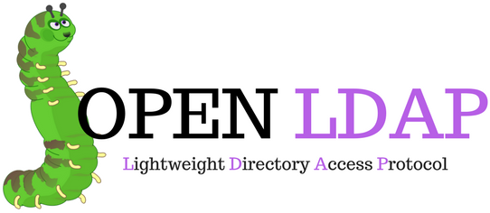
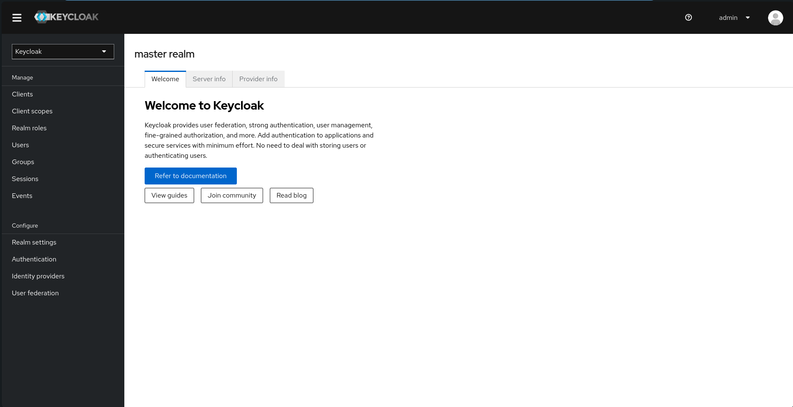
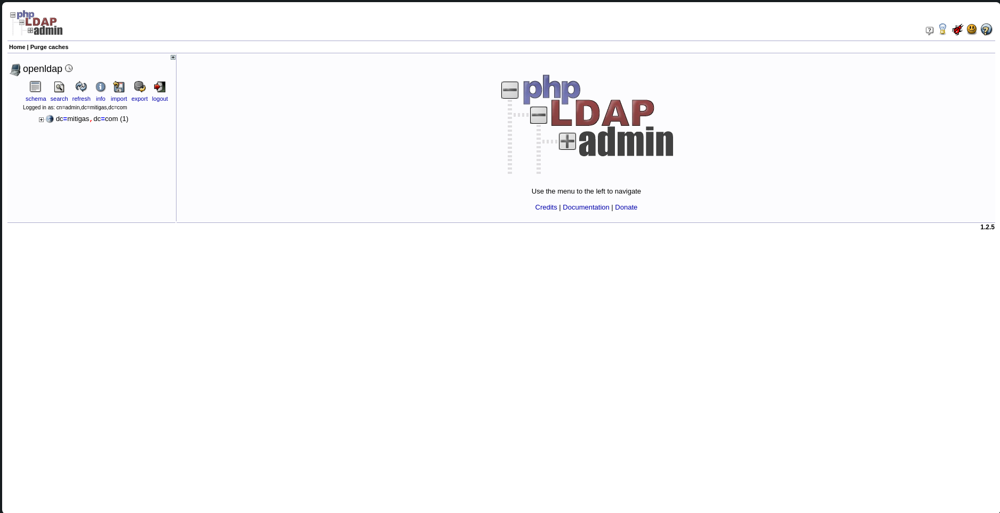

# LDAP Configuration


Repositori ini berisi file konfigurasi untuk menjalankan server LDAP menggunakan Docker Compose. Server ini akan menjalankan OpenLDAP, phpLDAPadmin, dan Keycloak dengan beberapa pengaturan yang telah dikonfigurasi.

## Daftar Konten

- [Struktur Direktori](#struktur-direktori)
- [Cara Menggunakan](#cara-menggunakan)
    - [Prasyarat](#prasyarat)
    - [Menyesuaikan File Template](#menyesuaikan-file-template)
    - [Menjalankan Container LDAP](#menjalankan-container-ldap)
    - [Mengakses LDAP, phpLDAPadmin, dan Keycloak](#mengakses-ldap-phpldapadmin-dan-keycloak)
    - [Inisialisasi Konfigurasi](#inisialisasi-konfigurasi)
    - [Troubleshooting](#troubleshooting)
    - [Port yang Digunakan](#port-yang-digunakan)
        - [Langkah-langkah Membuka Port](#langkah-langkah-membuka-port)
            - [Di Docker Host](#di-docker-host)
            - [Di Google Cloud Platform (GCP)](#di-google-cloud-platform-gcp)
    - [Konfigurasi Dengan Ansible](#konfigurasi-dengan-ansible)
    - [Setelah Service Berjalan](#setelah-service-berjalan)
    - [Informasi Tambahan](#informasi-tambahan)

## Struktur Direktori

- `docker-compose.yml`: File Docker Compose utama yang digunakan untuk menjalankan container LDAP.
- `docker-compose.yml.template`: Template file Docker Compose yang dapat disesuaikan dengan kebutuhan.
- `start-keycloak.sh`: Skrip untuk memulai Keycloak dengan konfigurasi tambahan.
- `readme.md`: File dokumentasi ini.

## Cara Menggunakan

### Prasyarat

Pastikan Anda telah menginstal Docker dan Docker Compose di sistem Anda. Jika belum, Anda dapat menginstalnya dengan mengikuti dokumentasi berikut:

- [Instalasi Docker](https://docs.docker.com/get-docker/)
- [Instalasi Docker Compose](https://docs.docker.com/compose/install/)

atau pada [Cara Instalasi Docker](../readme.md#instalasi-docker)

### Menyesuaikan File Template

Jika Anda ingin menyesuaikan konfigurasi, Anda dapat mengedit file `docker-compose.yml.template`. Gantilah placeholder dengan nilai yang sesuai:

```yaml
services:
  openldap:
    image: osixia/openldap:latest
    container_name: openldap
    hostname: openldap
    ports:
      - "389:389"
      - "636:636"
    volumes:
      - ./data/certificates:/container/service/slapd/assets/certs
      - ./data/slapd/database:/var/lib/ldap
      - ./data/slapd/config:/etc/ldap/slapd.d
    environment:
      - LDAP_ORGANISATION=[Nama Organisasi]
      - LDAP_DOMAIN=[domain.com]
      - LDAP_ADMIN_USERNAME=[admin_username]
      - LDAP_ADMIN_PASSWORD=[admin_password]
      - LDAP_CONFIG_PASSWORD=[config_password]
      - "LDAP_BASE_DN=[dc=domain,dc=com]"
      - LDAP_TLS_CRT_FILENAME=[server.crt]
      - LDAP_TLS_KEY_FILENAME=[server.key]
      - LDAP_TLS_CA_CRT_FILENAME=[ca.crt]
      - LDAP_READONLY_USER=true
      - LDAP_READONLY_USER_USERNAME=[readonly_username]
      - LDAP_READONLY_USER_PASSWORD=[readonly_password]
    networks:
      - openldap

  phpldapadmin:
    image: osixia/phpldapadmin:latest
    container_name: phpldapadmin
    hostname: phpldapadmin
    ports:
      - "8082:80"
    environment:
      - PHPLDAPADMIN_LDAP_HOSTS=openldap
      - PHPLDAPADMIN_HTTPS=false
    depends_on:
      - openldap
    networks:
      - openldap

  keycloak:
    image: quay.io/keycloak/keycloak:24.0.4
    container_name: keycloak
    hostname: keycloak
    ports:
      - "8081:8080"
    environment:
      - KEYCLOAK_ADMIN=[admin_username]
      - KEYCLOAK_ADMIN_PASSWORD=[admin_password]
      - KC_DB=dev-file
      - KC_HOSTNAME_STRICT=false
      - KC_HTTP_ENABLED=true
    volumes:
      - ./start-keycloak.sh:/opt/keycloak/bin/start-keycloak.sh
    entrypoint: ["/bin/bash", "/opt/keycloak/bin/start-keycloak.sh"]
    depends_on:
      - openldap
    networks:
      - openldap

networks:
  openldap:
    driver: bridge
```
Kredensial untuk masuk ke LDAP adalah sebagai berikut:
- **LDAP_ADMIN_USERNAME**: `cn=admin,dc=[domain],dc=com`
- **LDAP_ADMIN_PASSWORD**: `[admin_password]`
- **LDAP_READONLY_USER_USERNAME**: `cn=[readonly_username],dc=[domain],dc=com`
- **LDAP_READONLY_USER_PASSWORD**: `[readonly_password]`

### Menjalankan Container LDAP

1. **Kloning Repositori:**
   ```bash
   git clone https://github.com/SyahrulApr86/MITI-Configuration-files.git
   cd MITI-Configuration-files/LDAP
   ```

2. **Menjalankan Docker Compose:**
   Pastikan Anda berada di direktori yang berisi file `docker-compose.yml`, kemudian jalankan perintah berikut:
   ```bash
   sudo docker compose up -d
   ```

   Perintah ini akan mendownload image OpenLDAP, phpLDAPadmin, dan Keycloak (jika belum ada), membuat container, dan menjalankan server dengan konfigurasi yang telah ditentukan.

### Mengakses LDAP, phpLDAPadmin, dan Keycloak

Setelah container berjalan, Anda dapat mengakses layanan melalui browser menggunakan URL berikut:

- **OpenLDAP**: menggunakan port `389` untuk LDAP dan `636` untuk LDAPS.
- **phpLDAPadmin**: `http://localhost:8082`
- **Keycloak**: `http://localhost:8081`

### Inisialisasi Konfigurasi

Konfigurasi tambahan untuk Keycloak diinisialisasi menggunakan skrip `start-keycloak.sh`. Skrip ini memastikan bahwa Keycloak berjalan dalam mode pengembangan dan mengkonfigurasi kredensial admin.

### Troubleshooting

Jika Anda mengalami masalah saat menjalankan container, Anda dapat memeriksa log dengan perintah berikut:

```bash
sudo docker compose logs
```

Log ini akan memberikan informasi lebih lanjut tentang apa yang mungkin salah dan bagaimana cara memperbaikinya.

## Port yang Digunakan

Berdasarkan konfigurasi yang ada dalam file `docker-compose.yml`, port berikut perlu dibuka:
- **389**: Port LDAP
- **636**: Port LDAPS
- **8082**: Port phpLDAPadmin
- **8081**: Port Keycloak

### Langkah-langkah Membuka Port

Anda bisa mengikuti langkah-langkah berikut untuk membuka port yang diperlukan, atau Anda dapat melihat [Cara Membuat Firewall Rules](../readme.md#membuat-firewall-rules-di-gcp) jika menggunakan Google Cloud Platform.

#### Di Docker Host

Pastikan bahwa port yang diperlukan dibuka pada firewall di host Docker Anda sehingga klien dapat mengakses layanan LDAP, phpLDAPadmin, dan Keycloak. Jika Anda menggunakan ufw pada Ubuntu, Anda dapat membuka port dengan perintah berikut:

```bash
sudo ufw allow 389/tcp
sudo ufw allow 636/tcp
sudo ufw allow 8082/tcp
sudo ufw allow 8081/tcp
sudo ufw reload
```

#### Di Google Cloud Platform (GCP)

Jika Anda menjalankan instance di GCP, Anda perlu memastikan bahwa port yang diperlukan dibuka pada firewall rules GCP:

1. **Buka Google Cloud Console**.
2. **Navigasi ke VPC Network** > **Firewall**.
3. **Buat Firewall Rule Baru**:
    - Klik tombol **Create Firewall Rule**.
    - Masukkan detail berikut:
        - **Name**: `allow-ldap`
        - **Targets**: `Specified target tags` lalu beri nama tag `allow-ldap`
        - **Source IP ranges**: `0.0.0.0/0` (untuk akses publik) atau subnet spesifik.
        - **Protocols and ports**: Centang **Specified protocols and ports** dan masukkan `tcp:389`, `tcp:636`, `tcp:8082`, `tcp:8081`.
4. **Klik Create** untuk membuat firewall rule.
5. **Tambahkan Tag ke Instance**:
    - Navigasi ke **VM Instances**.
    - Klik instance yang ingin Anda akses.
    - Matikan instance jika sedang berjalan.
    - Klik **Edit**.
    - Pada bagian **Network tags**, tambahkan tag `allow-ldap`.
    - Klik **Save** untuk menyimpan perubahan.

## Konfigurasi Dengan Ansible

Anda juga dapat menggunakan Ansible untuk mengelola konfigurasi OpenLDAP, phpLDAPadmin, dan Keycloak (cara ini lebih sederhana). Anda dapat melihat cara menggunakannya di [Ansible Configuration](../Ansible/readme.md).

## Setelah Service Berjalan

Setelah service berjalan, Anda dapat mengakses OpenLDAP, phpLDAPadmin, dan Keycloak melalui browser menggunakan URL yang telah ditentukan. 
Contoh:
- **Keycloak**: http://[IP_EXTERNAL]:8081
    

- **phpLDAPadmin**: http://[IP_EXTERNAL]:8082
    

## Informasi Tambahan

Untuk informasi lebih lanjut tentang menggunakan dan mengkonfigurasi OpenLDAP, phpLDAPadmin, dan Keycloak di Docker, silakan merujuk ke dokumentasi resmi:

- [Dokumentasi OpenLDAP](https://www.openldap.org/doc/)
- [Dokumentasi phpLDAPadmin](https://github.com/leenooks/phpLDAPadmin)
- [Dokumentasi Keycloak](https://www.keycloak.org/documentation)
- [Dokumentasi Docker](https://docs.docker.com/)