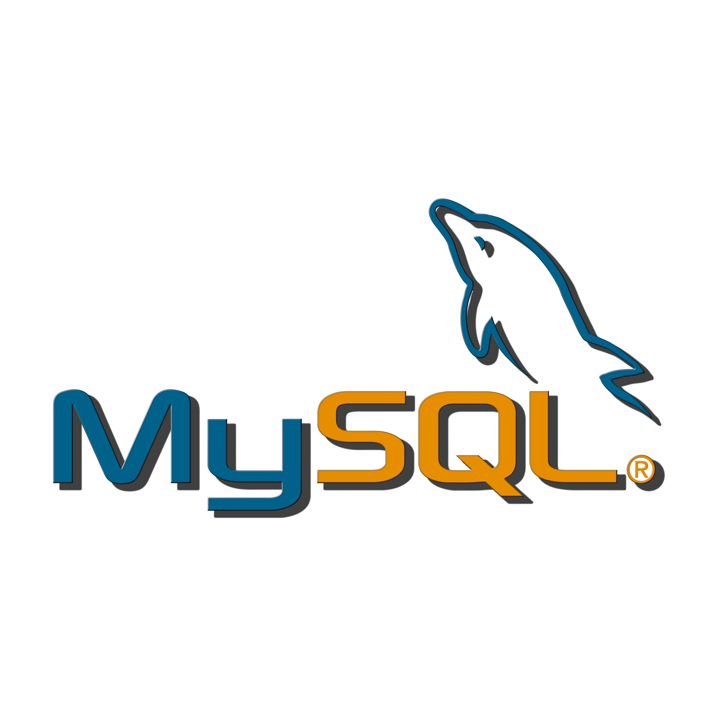

# MySQL Database Server Configuration



Repositori ini berisi file konfigurasi untuk menjalankan server database MySQL menggunakan Docker Compose. Server ini akan menjalankan MySQL versi 8.0 dengan beberapa database dan pengguna yang telah dikonfigurasi.

## Daftar Konten

- [Struktur Direktori](#struktur-direktori)
- [Cara Menggunakan](#cara-menggunakan)
    - [Prasyarat](#prasyarat)
    - [Menyesuaikan File Template](#menyesuaikan-file-template)
    - [Menjalankan Container MySQL](#menjalankan-container-mysql)
    - [Mengakses MySQL Server](#mengakses-mysql-server)
    - [Inisialisasi Database](#inisialisasi-database)
    - [Troubleshooting](#troubleshooting)
    - [Port yang Digunakan](#port-yang-digunakan)
        - [Langkah-langkah Membuka Port](#langkah-langkah-membuka-port)
            - [Di Docker Host](#di-docker-host)
            - [Di Google Cloud Platform (GCP)](#di-google-cloud-platform-gcp)
    - [Konfigurasi Dengan Ansible](#konfigurasi-dengan-ansible)
    - [Informasi Tambahan](#informasi-tambahan)

## Struktur Direktori

- `docker-compose.yml`: File Docker Compose utama yang digunakan untuk menjalankan container MySQL.
- `docker-compose.yml.template`: Template file Docker Compose yang dapat disesuaikan dengan kebutuhan.
- `init.sql`: File SQL yang berisi perintah untuk menginisialisasi database saat container pertama kali dijalankan.
- `readme.md`: File dokumentasi ini.

## Cara Menggunakan

### Prasyarat

Pastikan Anda telah menginstal Docker dan Docker Compose di sistem Anda. Jika belum, Anda dapat menginstalnya dengan mengikuti dokumentasi berikut:

- [Instalasi Docker](https://docs.docker.com/get-docker/)
- [Instalasi Docker Compose](https://docs.docker.com/compose/install/)

atau pada [Cara Instalasi Docker](../readme.md#instalasi-docker)

### Menyesuaikan File Template

Jika Anda ingin menyesuaikan konfigurasi, Anda dapat mengedit file `docker-compose.yml` dan `../.env`.

Isi file `.env` yang berada di direktori atas `docker-compose.yml`, dengan informasi berikut:
```bash
MYSQL_ROOT_PASSWORD=
MYSQL_USER=
MYSQL_PASSWORD=
```

Contoh isi `docker-compose.yml` yang merujuk ke file `.env` di direktori atasnya:
```yaml
services:
  db:
    image: mysql:8.0
    restart: always
    ports:
      - 3306:3306
    env_file:
      - ../.env
    environment:
      MYSQL_ROOT_PASSWORD: ${MYSQL_ROOT_PASSWORD}
      MYSQL_USER: ${MYSQL_USER}
      MYSQL_PASSWORD: ${MYSQL_PASSWORD}
      MYSQL_DATABASE: ${MYSQL_DATABASE}
    command: --default-authentication-plugin=caching_sha2_password
    volumes:
      - db_data:/var/lib/mysql
      - ./init.sql:/docker-entrypoint-initdb.d/init.sql

volumes:
  db_data:
```

### Menjalankan Container MySQL

1. **Kloning Repositori:**
   ```bash
   git clone https://github.com/SyahrulApr86/MITI-Configuration-files.git
   cd MITI-Configuration-files/MySQL/docker
   ```

2. **Menjalankan Docker Compose:**
   Pastikan Anda berada di direktori `docker` yang berisi file `docker-compose.yml`, kemudian jalankan perintah berikut:
   ```bash
   sudo docker compose --env-file ../.env up -d
   ```

   Perintah ini akan mendownload image MySQL (jika belum ada), membuat container, dan menjalankan MySQL server dengan konfigurasi yang telah ditentukan.

### Mengakses MySQL Server

Setelah container berjalan, Anda dapat mengakses MySQL server menggunakan klien MySQL atau alat manajemen basis data seperti phpMyAdmin. Gunakan informasi berikut untuk mengakses server:

- Host: `localhost`
- Port: `3306`
- Username: `databaseuser`
- Password: `passworddatabaseuser`
- Database: `initdb`

### Inisialisasi Database

File `init.sql` berisi perintah untuk membuat database tambahan dan memberikan hak akses kepada pengguna `databaseuser`. Berikut adalah isi file `init.sql`:

```sql
CREATE DATABASE IF NOT EXISTS wordpressweb;
CREATE DATABASE IF NOT EXISTS wordpressecomm;
CREATE DATABASE IF NOT EXISTS nextclouddb;
GRANT ALL PRIVILEGES ON wordpressweb.* TO 'databaseuser'@'%';
GRANT ALL PRIVILEGES ON wordpressecomm.* TO 'databaseuser'@'%';
GRANT ALL PRIVILEGES ON nextclouddb.* TO 'databaseuser'@'%';
FLUSH PRIVILEGES;
```

Perintah SQL ini akan dijalankan secara otomatis saat container pertama kali dijalankan.

## Troubleshooting

Jika Anda mengalami masalah saat menjalankan container, Anda dapat memeriksa log dengan perintah berikut:

```bash
sudo docker compose logs
```

Log ini akan memberikan informasi lebih lanjut tentang apa yang mungkin salah dan bagaimana cara memperbaikinya.

## Port yang Digunakan

Berdasarkan konfigurasi yang ada dalam file `docker-compose.yml`, hanya port 3306 yang perlu dibuka (untuk saat ini). Port ini digunakan oleh MySQL untuk komunikasi dengan klien database.

### Langkah-langkah Membuka Port

Anda bisa mengikuti langkah-langkah berikut untuk membuka port 3306, atau anda dapat melihat [Cara Membuat Firewall Rules](../readme.md#membuat-firewall-rules-di-gcp) jika menggunakan Google Cloud Platform.

#### Di Docker Host

Pastikan bahwa port 3306 dibuka pada firewall di host Docker Anda sehingga klien dapat mengakses MySQL server. Jika Anda menggunakan ufw pada Ubuntu, Anda dapat membuka port dengan perintah berikut:

```bash
sudo ufw allow 3306/tcp
sudo ufw reload
```

#### Di Google Cloud Platform (GCP)

Jika Anda menjalankan instance di GCP, Anda perlu memastikan bahwa port 3306 dibuka pada firewall rules GCP:

1. **Buka Google Cloud Console**.
2. **Navigasi ke VPC Network** > **Firewall**.
3. **Buat Firewall Rule Baru**:
    - Klik tombol **Create Firewall Rule**.
    - Masukkan detail berikut:
        - **Name**: `allow-mysql`
        - **Targets**: `Specified target tags` lalu beri nama tag `allow-mysql`
        - **Source IP ranges**: `0.0.0.0/0` (untuk akses publik) atau subnet spesifik.
        - **Protocols and ports**: Centang **Specified protocols and ports** dan masukkan `tcp:3306`.
4. **Klik Create** untuk membuat firewall rule.
5. **Tambahkan Tag ke Instance**:
    - Navigasi ke **VM Instances**.
    - Klik instance yang ingin Anda akses.
    - Matikan instance jika sedang berjalan.
    - Klik **Edit**.
    - Pada bagian **Network tags**, tambahkan tag `allow-mysql`.
    - Klik **Save** untuk menyimpan perubahan.

## Konfigurasi Dengan Ansible

Anda juga dapat menggunakan Ansible untuk mengelola konfigurasi MySQL dan Docker (cara ini lebih sederhana). Anda dapat melihat cara menggunakannya di [Ansible Configuration](../Ansible/readme.md).

## Informasi Tambahan

Untuk informasi lebih lanjut tentang menggunakan dan mengkonfigurasi MySQL di Docker, silakan merujuk ke dokumentasi resmi MySQL dan Docker:

- [Dokumentasi MySQL](https://dev.mysql.com/doc/)
- [Dokumentasi Docker](https://docs.docker.com/)
