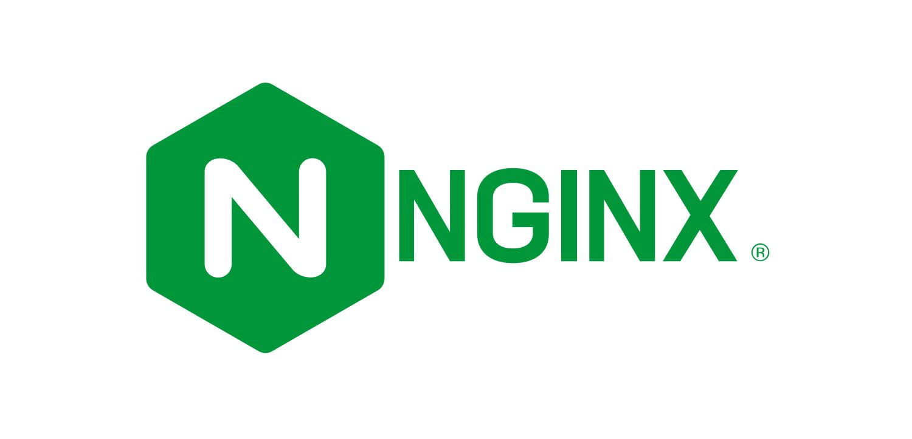

# NGINX E-commerce Configuration

Repositori ini berisi file konfigurasi untuk menjalankan server NGINX sebagai reverse proxy untuk e-commerce menggunakan Docker Compose. Server ini akan menjalankan NGINX dengan beberapa pengaturan yang telah dikonfigurasi.

## Daftar Konten

- [Struktur Direktori](#struktur-direktori)
- [Cara Menggunakan](#cara-menggunakan)
    - [Prasyarat](#prasyarat)
    - [Menyesuaikan File Template](#menyesuaikan-file-template)
    - [Menjalankan Container NGINX](#menjalankan-container-nginx)
    - [Mengakses NGINX](#mengakses-nginx)
    - [Inisialisasi Konfigurasi](#inisialisasi-konfigurasi)
    - [Troubleshooting](#troubleshooting)
    - [Port yang Digunakan](#port-yang-digunakan)
        - [Langkah-langkah Membuka Port](#langkah-langkah-membuka-port)
            - [Di Docker Host](#di-docker-host)
            - [Di Google Cloud Platform (GCP)](#di-google-cloud-platform-gcp)
    - [Konfigurasi Dengan Ansible](#konfigurasi-dengan-ansible)
    - [Setelah Service Berjalan](#setelah-service-berjalan)
    - [Informasi Tambahan](#informasi-tambahan)

## Struktur Direktori

- `docker-compose.yml`: File Docker Compose utama yang digunakan untuk menjalankan container NGINX.
- `image`: Direktori yang berisi gambar untuk dokumentasi.
    - `nginx-logo.png`: Logo NGINX.
    - `nginx-web.png`: Screenshot NGINX.
- `nginx.conf`: File konfigurasi NGINX yang digunakan untuk mengatur reverse proxy.
- `nginx.conf.template`: Template file konfigurasi NGINX yang dapat disesuaikan dengan kebutuhan.
- `readme.md`: File dokumentasi ini.

## Cara Menggunakan

### Prasyarat

Pastikan Anda telah menginstal Docker dan Docker Compose di sistem Anda. Jika belum, Anda dapat menginstalnya dengan mengikuti dokumentasi berikut:

- [Instalasi Docker](https://docs.docker.com/get-docker/)
- [Instalasi Docker Compose](https://docs.docker.com/compose/install/)

atau pada [Cara Instalasi Docker](../readme.md#instalasi-docker)

### Menyesuaikan File Template

Jika Anda ingin menyesuaikan konfigurasi, Anda dapat mengedit file `nginx.conf.template`. Gantilah placeholder dengan nilai yang sesuai:

```nginx
events {
    worker_connections 1024;
}

http {
    log_format main '$remote_addr - $remote_user [$time_local] "$request" '
                    '$status $body_bytes_sent "$http_referer" '
                    '"$http_user_agent" "$http_x_forwarded_for"';

    access_log /var/log/nginx/access.log main;

    upstream wordpress_backend {
        server [IP_ECOMMERCE_1];  # IP internal dari ecommerce-1
        server [IP_ECOMMERCE_2];  # IP internal dari ecommerce-2
    }

    server {
        listen 80;

        location / {
            proxy_pass http://wordpress_backend;
            proxy_set_header Host $host;
            proxy_set_header X-Real-IP $remote_addr;
            proxy_set_header X-Forwarded-For $proxy_add_x_forwarded_for;
            proxy_set_header X-Forwarded-Proto $scheme;
        }
    }
}
```

### Menjalankan Container NGINX

1. **Kloning Repositori:**
   ```bash
   git clone https://github.com/SyahrulApr86/MITI-Configuration-files.git
   cd MITI-Configuration-files/NGINX-Ecommerce
   ```

2. **Menjalankan Docker Compose:**
   Pastikan Anda berada di direktori yang berisi file `docker-compose.yml`, kemudian jalankan perintah berikut:
   ```bash
   sudo docker compose up -d
   ```

   Perintah ini akan mendownload image NGINX (jika belum ada), membuat container, dan menjalankan NGINX server dengan konfigurasi yang telah ditentukan.

### Mengakses NGINX

Setelah container berjalan, Anda dapat mengakses NGINX melalui browser menggunakan URL berikut:

- URL: `http://localhost`

### Inisialisasi Konfigurasi

Konfigurasi NGINX diinisialisasi menggunakan file `nginx.conf`. Pastikan IP address dari backend server (`ecommerce-1` dan `ecommerce-2`) sudah benar dan dapat diakses oleh container NGINX.

### Troubleshooting

Jika Anda mengalami masalah saat menjalankan container, Anda dapat memeriksa log dengan perintah berikut:

```bash
sudo docker compose logs
```

Log ini akan memberikan informasi lebih lanjut tentang apa yang mungkin salah dan bagaimana cara memperbaikinya.

## Port yang Digunakan

Berdasarkan konfigurasi yang ada dalam file `docker-compose.yml`, hanya port 80 yang perlu dibuka. Port ini digunakan oleh NGINX untuk komunikasi dengan klien web.

### Langkah-langkah Membuka Port

Anda bisa mengikuti langkah-langkah berikut untuk membuka port 80, atau Anda dapat melihat [Cara Membuat Firewall Rules](../readme.md#membuat-firewall-rules-di-gcp) jika menggunakan Google Cloud Platform.

#### Di Docker Host

Pastikan bahwa port 80 dibuka pada firewall di host Docker Anda sehingga klien dapat mengakses NGINX server. Jika Anda menggunakan ufw pada Ubuntu, Anda dapat membuka port dengan perintah berikut:

```bash
sudo ufw allow 80/tcp
sudo ufw reload
```

#### Di Google Cloud Platform (GCP)

Jika Anda menjalankan instance di GCP, Anda perlu memastikan bahwa port 80 dibuka pada firewall rules GCP:

1. **Buka Google Cloud Console**.
2. **Navigasi ke VPC Network** > **Firewall**.
3. **Buat Firewall Rule Baru**:
    - Klik tombol **Create Firewall Rule**.
    - Masukkan detail berikut:
        - **Name**: `allow-http`
        - **Targets**: `Specified target tags` lalu beri nama tag `allow-http`
        - **Source IP ranges**: `0.0.0.0/0` (untuk akses publik) atau subnet spesifik.
        - **Protocols and ports**: Centang **Specified protocols and ports** dan masukkan `tcp:80`.
4. **Klik Create** untuk membuat firewall rule.
5. **Tambahkan Tag ke Instance**:
    - Navigasi ke **VM Instances**.
    - Klik instance yang ingin Anda akses.
    - Matikan instance jika sedang berjalan.
    - Klik **Edit**.
    - Pada bagian **Network tags**, tambahkan tag `allow-http`.
    - Klik **Save** untuk menyimpan perubahan.

## Konfigurasi Dengan Ansible

Anda juga dapat menggunakan Ansible untuk mengelola konfigurasi NGINX dan Docker (cara ini lebih sederhana). Anda dapat melihat cara menggunakannya di [Ansible Configuration](../Ansible/readme.md).

## Setelah Service Berjalan

Setelah service berjalan, Anda dapat mengakses NGINX melalui browser menggunakan URL `<ip_external>` untuk mengakses aplikasi yang ada di backend server. Selamat mencoba!


## Informasi Tambahan

Untuk informasi lebih lanjut tentang menggunakan dan mengkonfigurasi NGINX di Docker, silakan merujuk ke dokumentasi resmi NGINX dan Docker:

- [Dokumentasi NGINX](https://nginx.org/en/docs/)
- [Dokumentasi Docker](https://docs.docker.com/)
