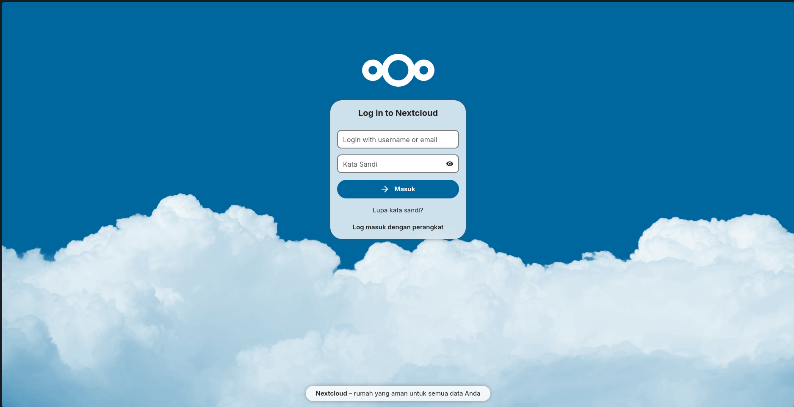
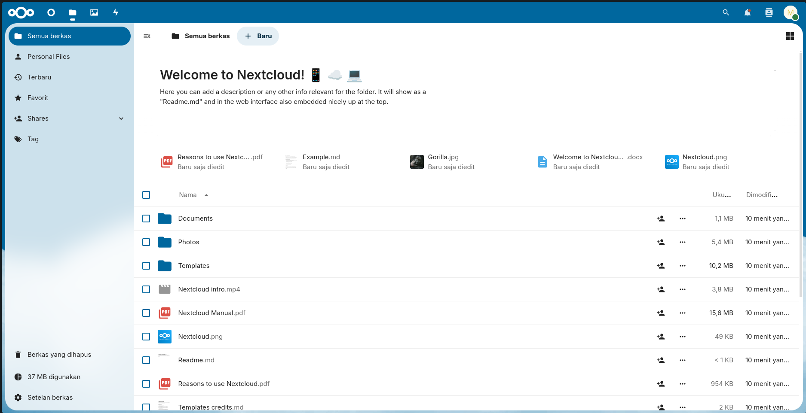

# Nextcloud Configuration


Repositori ini berisi file konfigurasi untuk menjalankan server Nextcloud menggunakan Docker Compose. Server ini akan menjalankan Nextcloud dengan beberapa pengaturan yang telah dikonfigurasi.

## Daftar Konten

- [Struktur Direktori](#struktur-direktori)
- [Cara Menggunakan](#cara-menggunakan)
    - [Prasyarat](#prasyarat)
    - [Menyesuaikan File Template](#menyesuaikan-file-template)
    - [Membangun dan Menjalankan Container Nextcloud](#membangun-dan-menjalankan-container-nextcloud)
    - [Mengakses Nextcloud](#mengakses-nextcloud)
    - [Inisialisasi Konfigurasi](#inisialisasi-konfigurasi)
    - [Troubleshooting](#troubleshooting)
    - [Port yang Digunakan](#port-yang-digunakan)
        - [Langkah-langkah Membuka Port](#langkah-langkah-membuka-port)
            - [Di Docker Host](#di-docker-host)
            - [Di Google Cloud Platform (GCP)](#di-google-cloud-platform-gcp)
    - [Konfigurasi Dengan Ansible](#konfigurasi-dengan-ansible)
    - [Setelah Service Berjalan](#setelah-service-berjalan)
    - [Informasi Tambahan](#informasi-tambahan)

## Struktur Direktori

- `add_trusted_domain.php`: Skrip PHP untuk menambahkan `trusted_domain` ke konfigurasi Nextcloud.
- `custom_entrypoint.sh`: Skrip custom entrypoint untuk menjalankan Nextcloud dengan konfigurasi tambahan.
- `docker-compose.yml`: File Docker Compose utama yang digunakan untuk menjalankan container Nextcloud.
- `Dockerfile`: Dockerfile untuk membangun image Nextcloud dengan konfigurasi khusus.
- `Dockerfile.template`: Template Dockerfile yang dapat disesuaikan dengan kebutuhan.
- `update_ip.sh`: Skrip untuk memperbarui IP eksternal dan menambahkannya sebagai domain tepercaya di Nextcloud.
- `readme.md`: File dokumentasi ini.

## Cara Menggunakan

### Prasyarat

Pastikan Anda telah menginstal Docker dan Docker Compose di sistem Anda. Jika belum, Anda dapat menginstalnya dengan mengikuti dokumentasi berikut:

- [Instalasi Docker](https://docs.docker.com/get-docker/)
- [Instalasi Docker Compose](https://docs.docker.com/compose/install/)

atau pada [Cara Instalasi Docker](../readme.md#instalasi-docker)

### Menyesuaikan File Template

Jika Anda ingin menyesuaikan konfigurasi, Anda dapat mengedit file `Dockerfile.template`. dan `../.env`.

Isi file `.env` yang berada di direktori atas `docker-compose.yml`, dengan informasi berikut:
```bash
MYSQL_PASSWORD=
MYSQL_HOST=
NEXTCLOUD_ADMIN_USER=
NEXTCLOUD_ADMIN_PASSWORD=
NEXTCLOUD_TRUSTED_DOMAINS=
```


### Membangun dan Menjalankan Container Nextcloud

1. **Kloning Repositori:**
   ```bash
   git clone https://github.com/SyahrulApr86/MITI-Configuration-files.git
   cd MITI-Configuration-files/Nextcloud
   ```

2. **Menjalankan Docker Compose:**
   Pastikan Anda berada di direktori yang berisi file `docker-compose.yml`, kemudian jalankan perintah berikut:
   ```bash
   sudo docker compose --env-file ../.env build --no-cache
   sudo docker compose --env-file ../.env up -d
   ```

   Perintah ini akan mendownload image Nextcloud (jika belum ada), membuat container, dan menjalankan Nextcloud server dengan konfigurasi yang telah ditentukan.

### Mengakses Nextcloud

Setelah container berjalan, Anda dapat mengakses Nextcloud melalui browser menggunakan URL berikut:

- URL: `http://localhost` atau `http://<ip_external>`

### Inisialisasi Konfigurasi

Konfigurasi Nextcloud diinisialisasi menggunakan skrip `custom_entrypoint.sh` yang akan menjalankan skrip `update_ip.sh` untuk menambahkan IP eksternal sebagai domain tepercaya. Hal ini karena Nextcloud memerlukan domain yang tepercaya untuk mengakses server sehingga ketika IP eksternal berubah, domain tepercaya harus diperbarui, hal ini jika dilakukan secara manual akan memakan waktu dan tidak efisien, apalagi jika server berada di cloud dengan IP yang berubah-ubah.

### Troubleshooting

Jika Anda mengalami masalah saat menjalankan container, Anda dapat memeriksa log dengan perintah berikut:

```bash
sudo docker compose logs
```

Log ini akan memberikan informasi lebih lanjut tentang apa yang mungkin salah dan bagaimana cara memperbaikinya.

## Port yang Digunakan

Berdasarkan konfigurasi yang ada dalam file `docker-compose.yml`, hanya port 80 yang perlu dibuka. Port ini digunakan oleh Nextcloud untuk komunikasi dengan klien web.

### Langkah-langkah Membuka Port

Anda bisa mengikuti langkah-langkah berikut untuk membuka port 80, atau Anda dapat melihat [Cara Membuat Firewall Rules](../readme.md#membuat-firewall-rules-di-gcp) jika menggunakan Google Cloud Platform.

#### Di Docker Host

Pastikan bahwa port 80 dibuka pada firewall di host Docker Anda sehingga klien dapat mengakses Nextcloud server. Jika Anda menggunakan ufw pada Ubuntu, Anda dapat membuka port dengan perintah berikut:

```bash
sudo ufw allow 80/tcp
sudo ufw reload
```

#### Di Google Cloud Platform (GCP)

Jika Anda menjalankan instance di GCP, Anda perlu memastikan bahwa port 80 dibuka pada firewall rules GCP:

1. **Buka Google Cloud Console**.
2. **Navigasi ke VPC Network** > **Firewall**.
3. **Buat Firewall Rule Baru**:
    - Klik tombol **Create Firewall Rule**.
    - Masukkan detail berikut:
        - **Name**: `allow-http`
        - **Targets**: `Specified target tags` lalu beri nama tag `allow-http`
        - **Source IP ranges**: `0.0.0.0/0` (untuk akses publik) atau subnet spesifik.
        - **Protocols and ports**: Centang **Specified protocols and ports** dan masukkan `tcp:80`.
4. **Klik Create** untuk membuat firewall rule.
5. **Tambahkan Tag ke Instance**:
    - Navigasi ke **VM Instances**.
    - Klik instance yang ingin Anda akses.
    - Matikan instance jika sedang berjalan.
    - Klik **Edit**.
    - Pada bagian **Network tags**, tambahkan tag `allow-http`.
    - Klik **Save** untuk menyimpan perubahan.

## Konfigurasi Dengan Ansible

Anda juga dapat menggunakan Ansible untuk mengelola konfigurasi Nextcloud dan Docker (cara ini lebih sederhana). Anda dapat melihat cara menggunakannya di [Ansible Configuration](../Ansible/readme.md).

## Setelah Service Berjalan

Setelah service berjalan, Anda dapat mengakses Nextcloud melalui browser menggunakan URL `<ip_external>` untuk mengakses aplikasi Nextcloud. Selamat mencoba!



Setelah login, tampilannya akan seperti ini:


## Informasi Tambahan

Untuk informasi lebih lanjut tentang menggunakan dan mengkonfigurasi Nextcloud di Docker, silakan merujuk ke dokumentasi resmi Nextcloud dan Docker:

- [Dokumentasi Nextcloud](https://docs.nextcloud.com/)
- [Dokumentasi Docker](https://docs.docker.com/)
