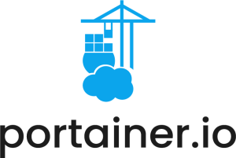
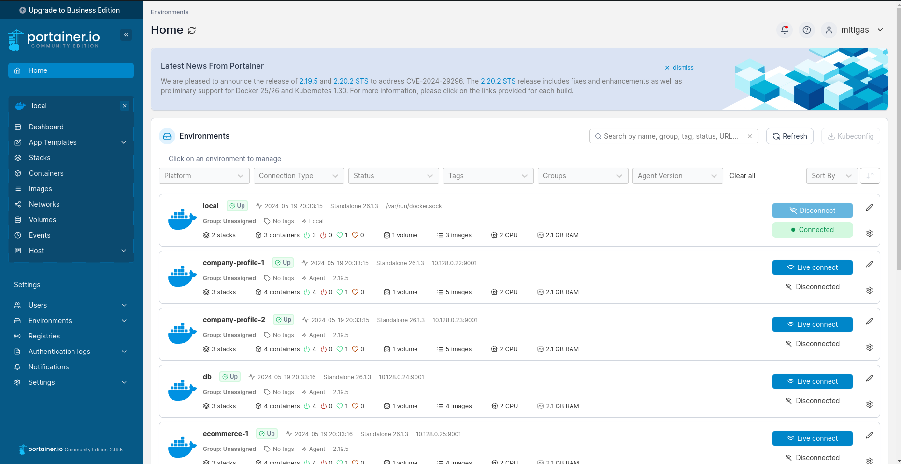

# Portainer Configuration



Repositori ini berisi file konfigurasi untuk menjalankan server Portainer dan agennya menggunakan Docker Compose. Server ini akan menjalankan Portainer dan agennya dengan beberapa pengaturan yang telah dikonfigurasi.

## Daftar Konten

- [Struktur Direktori](#struktur-direktori)
- [Cara Menggunakan](#cara-menggunakan)
    - [Prasyarat](#prasyarat)
    - [Menyesuaikan File Template](#menyesuaikan-file-template)
    - [Menjalankan Container Portainer](#menjalankan-container-portainer)
    - [Mengakses Portainer](#mengakses-portainer)
    - [Inisialisasi Konfigurasi](#inisialisasi-konfigurasi)
    - [Troubleshooting](#troubleshooting)
    - [Port yang Digunakan](#port-yang-digunakan)
        - [Langkah-langkah Membuka Port](#langkah-langkah-membuka-port)
            - [Di Docker Host](#di-docker-host)
            - [Di Google Cloud Platform (GCP)](#di-google-cloud-platform-gcp)
    - [Konfigurasi Dengan Ansible](#konfigurasi-dengan-ansible)
    - [Setelah Service Berjalan](#setelah-service-berjalan)
    - [Informasi Tambahan](#informasi-tambahan)

## Struktur Direktori

- `Agent/docker-compose.yml`: File Docker Compose untuk menjalankan Portainer Agent.
- `docker-compose.yml`: File Docker Compose utama yang digunakan untuk menjalankan container Portainer.
- `image`: Direktori yang berisi gambar untuk dokumentasi.
- `readme.md`: File dokumentasi ini.

## Cara Menggunakan

### Prasyarat

Pastikan Anda telah menginstal Docker dan Docker Compose di sistem Anda. Jika belum, Anda dapat menginstalnya dengan mengikuti dokumentasi berikut:

- [Instalasi Docker](https://docs.docker.com/get-docker/)
- [Instalasi Docker Compose](https://docs.docker.com/compose/install/)

atau pada [Cara Instalasi Docker](../readme.md#instalasi-docker)

### Menjalankan Container Portainer

1. **Kloning Repositori:**
   ```bash
   git clone https://github.com/SyahrulApr86/MITI-Configuration-files.git
   cd MITI-Configuration-files/Portainer
   ```

2. **Menjalankan Docker Compose:**
   Pastikan Anda berada di direktori yang berisi file `docker-compose.yml`, kemudian jalankan perintah berikut:
   ```bash
   sudo docker compose up -d
   ```

   Perintah ini akan mendownload image Portainer (jika belum ada), membuat container, dan menjalankan Portainer server dengan konfigurasi yang telah ditentukan.

### Mengakses Portainer

Setelah service Portainer siap, Anda dapat mengaksesnya melalui browser menggunakan URL berikut:

- URL: `https://<ip_external>:9443/` (ingat harus menggunakan `https`)

### Menjalankan Portainer Agent

Untuk setiap host yang ingin dimonitor, Anda harus menjalankan Portainer Agent. Anda dapat melakukannya dengan menjalankan docker compose yang ada di folder `./Agent`:

1. **Menjalankan Docker Compose di Host yang Ingin Dimonitor:**
   ```bash
   cd Agent
   sudo docker compose up -d
   ```

Anda juga dapat mengotomatisasi proses ini dengan menggunakan [Ansible](../Ansible/readme.md).

### Inisialisasi Konfigurasi

Setelah Portainer dan agennya berjalan, buka halaman Portainer melalui URL yang telah disebutkan sebelumnya. Tambahkan agen dengan memasukkan `ip_internal:9001` dan nama agen tersebut. Jika Anda ingin menggunakan `ip_external`, Anda harus mengkonfigurasi firewall di host yang akan dimonitor agar port 9001 dapat diakses dari luar.

### Troubleshooting

Jika Anda mengalami masalah saat menjalankan container, Anda dapat memeriksa log dengan perintah berikut:

```bash
sudo docker compose logs
```

Log ini akan memberikan informasi lebih lanjut tentang apa yang mungkin salah dan bagaimana cara memperbaikinya.

## Port yang Digunakan

Berdasarkan konfigurasi yang ada dalam file `docker-compose.yml`, berikut adalah port yang perlu dibuka:

* **Portainer**: `8000`, `9443`
* **Portainer Agent**: `9001`

### Langkah-langkah Membuka Port

Anda bisa mengikuti langkah-langkah berikut untuk membuka port yang diperlukan, atau Anda dapat melihat [Cara Membuat Firewall Rules](../readme.md#membuat-firewall-rules-di-gcp) jika menggunakan Google Cloud Platform.

#### I. Di Docker Host

Pastikan bahwa port yang diperlukan dibuka pada firewall di host Docker Anda sehingga klien dapat mengakses layanan. Jika Anda menggunakan ufw pada Ubuntu, Anda dapat membuka port dengan perintah berikut:

```bash
sudo ufw allow 8000/tcp
sudo ufw allow 9443/tcp
sudo ufw allow 9001/tcp
sudo ufw reload
```

#### II. Di Google Cloud Platform (GCP)

Jika Anda menjalankan instance di GCP, Anda perlu memastikan bahwa port yang diperlukan dibuka pada firewall rules GCP:

1. **Buka Google Cloud Console**.
2. **Navigasi ke VPC Network** > **Firewall**.
3. **Buat Firewall Rule Baru**:
    - Klik tombol **Create Firewall Rule**.
    - Masukkan detail berikut:
        - **Name**: `allow-portainer`
        - **Targets**: `Specified target tags` lalu beri nama tag `allow-portainer`
        - **Source IP ranges**: `0.0.0.0/0` (untuk akses publik) atau subnet spesifik.
        - **Protocols and ports**: Centang **Specified protocols and ports** dan masukkan `tcp:8000,tcp:9443,tcp:9001`.
4. **Klik Create** untuk membuat firewall rule.
5. **Tambahkan Tag ke Instance**:
    - Navigasi ke **VM Instances**.
    - Klik instance yang ingin Anda akses.
    - Matikan instance jika sedang berjalan.
    - Klik **Edit**.
    - Pada bagian **Network tags**, tambahkan tag `allow-portainer`.
    - Klik **Save** untuk menyimpan perubahan.

## Konfigurasi Dengan Ansible

Anda juga dapat menggunakan Ansible untuk mengelola konfigurasi Portainer dan Docker (cara ini lebih sederhana). Anda dapat melihat cara menggunakannya di [Ansible Configuration](../Ansible/readme.md).

## Setelah Service Berjalan

Setelah service berjalan, Anda dapat mengakses Portainer melalui browser menggunakan URL `https://<ip_external>:9443/` untuk mengakses Portainer. Untuk setiap host yang ingin dimonitor, jalankan agen Portainer dan tambahkan agen dengan memasukkan `ip_internal:9001` dan nama agen tersebut. Jika menggunakan `ip_external`, konfigurasikan firewall di host yang akan dimonitor agar port 9001 dapat diakses dari luar.



## Informasi Tambahan

Untuk informasi lebih lanjut tentang menggunakan dan mengkonfigurasi Portainer di Docker, silakan merujuk ke dokumentasi resmi Portainer dan Docker:

- [Dokumentasi Portainer](https://www.portainer.io/documentation)
- [Dokumentasi Docker](https://docs.docker.com/)