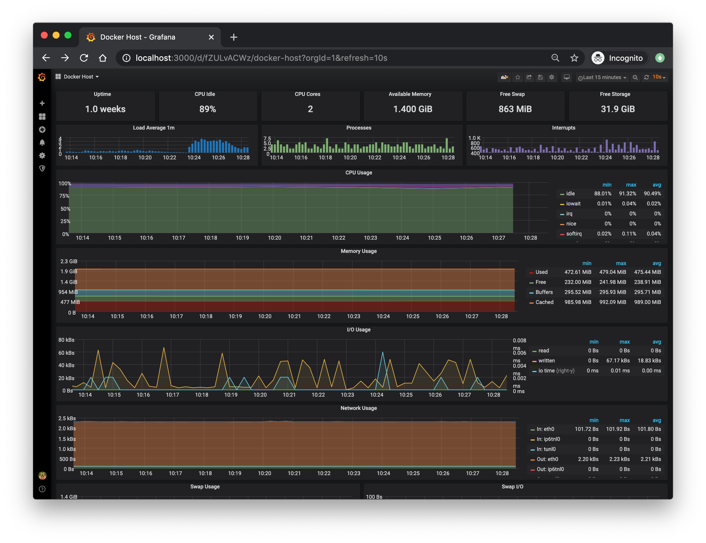

# Prometheus - Grafana Configuration


Solusi pemantauan untuk host dan kontainer Docker dengan [Prometheus](https://prometheus.io/), [Grafana](http://grafana.org/), [cAdvisor](https://github.com/google/cadvisor),
[NodeExporter](https://github.com/prometheus/node_exporter) dan sistem peringatan dengan [AlertManager](https://github.com/prometheus/alertmanager).

Ini adalah repositori yang di-fork. Jadi, Anda mungkin ingin mengunjungi repositori asli di [stefanprodan/dockprom](https://github.com/stefanprodan/dockprom)

Info tambahan: [Docker - Prometheus and Grafana](https://bogotobogo.com/DevOps/Docker/Docker_Prometheus_Grafana.php)

## Daftar Konten

- [Struktur Direktori](#struktur-direktori)
- [Prasyarat](#prasyarat)
- [Kontainer](#kontainer)
- [Instalasi](#instalasi)
- [Docker Host Dashboard](#docker-host-dashboard)
- [Alerting](#alerting)

## Struktur Direktori

```plaintext
.
├── alertmanager
│   └── config.yml
├── docker-compose.yml
├── exporter
│   └── docker-compose.yml
├── grafana
│   └── provisioning
│       ├── dashboards
│       │   ├── dashboard.yml
│       │   ├── docker_containers.json
│       │   ├── docker_host.json
│       │   ├── monitor_services.json
│       │   └── nginx_container.json
│       └── datasources
│           └── datasource.yml
├── prometheus
│   ├── alert.rules
│   └── prometheus.yml
├── readme.md
├── README.md
└── screens
```


## Prasyarat:

* Docker Engine >= 1.13
* Docker Compose >= 1.11

## Kontainer:

* Prometheus (database metrik) `http://<host-ip>:9090`
* Prometheus-Pushgateway (penerima push untuk pekerjaan sementara dan batch) `http://<host-ip>:9091`
* AlertManager (manajemen peringatan) `http://<host-ip>:9093`
* Grafana (visualisasi metrik) `http://<host-ip>:3000`
* NodeExporter (pengumpul metrik host) `http://<host-ip>:9100`
* cAdvisor (pengumpul metrik kontainer) `http://<host-ip>:8080`

## Instalasi

1. **Kloning Repositori:**
   ```bash
   git clone https://github.com/SyahrulApr86/MITI-Configuration-files.git
   cd MITI-Configuration-files/Prometheus-Grafana
   ```

2. **Menjalankan NodeExporter dan cAdvisor pada masing-masing host yang ingin dipantau:**
   Anda dapat menjalankan NodeExporter dan cAdvisor pada tiap host dengan menjalankan docker compose yang ada di folder `./exporter`:
    ```yaml
    services:
      nodeexporter:
        image: prom/node-exporter:v1.8.0
        container_name: nodeexporter
        volumes:
          - /proc:/host/proc:ro
          - /sys:/host/sys:ro
          - /:/rootfs:ro
        command:
          - '--path.procfs=/host/proc'
          - '--path.rootfs=/rootfs'
          - '--path.sysfs=/host/sys'
          - '--collector.filesystem.ignored-mount-points=^/(sys|proc|dev|host|etc)($$|/)'
        restart: unless-stopped
        network_mode: host
        labels:
          org.label-schema.group: "monitoring"
    
      cadvisor:
        image: gcr.io/cadvisor/cadvisor:v0.49.1
        container_name: cadvisor
        volumes:
          - /:/rootfs:ro
          - /var/run:/var/run:rw
          - /sys:/sys:ro
          - /var/lib/docker/:/var/lib/docker:ro
          - /dev/disk/:/dev/disk:ro
        restart: unless-stopped
        network_mode: host
        privileged: true
        devices:
          - /dev/kmsg
        labels:
          org.label-schema.group: "monitoring"
    ```
   Anda harus menjalankannya pada setiap host yang ingin dipantau baik dengan SSH ke masing-masing host atau dengan menggunakan [Ansible](../Ansible/readme.md). Kemudian pastikan Anda membuka port yang diperlukan (9100 dan 8080) pada firewall masing-masing host yang ingin dipantau.

3. **Menjalankan Services pada Host Utama:**
   Selanjutnya anda dapat tinggal menjalankan docker compose pada host utama:
   ```bash
   sudo docker compose up -d
   ```

4. **Pengaturan Grafana**
   
   Buka `http://<host-ip>:3000` dan login dengan pengguna dan kata sandi sesuai dengan yang Anda definisikan pada docker compose Anda. Anda dapat mengubah kredensial dalam file compose atau dengan menyediakan variabel lingkungan `ADMIN_USER` dan `ADMIN_PASSWORD` melalui file .env saat compose up. File konfigurasi dapat ditambahkan langsung di bagian grafana seperti ini:
   ```yaml
   grafana:
     image: grafana/grafana:5.2.4
     env_file:
       - config
   ```
   dan format file config harus berisi konten berikut:
   ```env
   GF_SECURITY_ADMIN_USER=admin
   GF_SECURITY_ADMIN_PASSWORD=changeme
   GF_USERS_ALLOW_SIGN_UP=false
   ```
   
   Grafana sudah dikonfigurasi dengan dasbor dan Prometheus sebagai sumber data default:
   
   * Nama: Prometheus
     * Jenis: Prometheus
     * Url: http://prometheus:9090

5. **Importing Dashboards**

    Anda dapat mengimpor dasbor pada Grafana dengan memilih menu Dashboards > New > Import dan memasukkan ID dasbor yang ingin Anda impor. Berikut adalah beberapa ID dasbor yang disarankan:
     - [193](https://grafana.com/grafana/dashboards/193-docker-monitoring/) - Ini adalah dasbor yang menunjukkan metrik kunci untuk memantau kontainer Docker Anda yang metricnya berasal dari cAdvisor.
     - [1860](https://grafana.com/grafana/dashboards/1860-node-exporter-full/) - Dasbor ini menunjukkan metrik kunci untuk memantau host Anda yang metricnya berasal dari NodeExporter.
     - [13946](https://grafana.com/grafana/dashboards/13946-docker-cadvisor/) - Dasbor ini menunjukkan metrik kunci untuk memantau kontainer Docker Anda yang metricnya berasal dari cAdvisor.

6. **Mengkonfigurasi Port yang Diperlukan**

   Berdasarkan konfigurasi yang ada dalam file `docker-compose.yml`, beberapa port perlu dibuka. Berikut adalah daftar port yang digunakan oleh setiap layanan:

   * **Prometheus**: `9090`
   * **Prometheus-Pushgateway**: `9091`
   * **AlertManager**: `9093`
   * **Grafana**: `3000`
   * **NodeExporter**: `9100`
   * **cAdvisor**: `8080`

   #### Langkah-langkah Membuka Port
   
   Anda bisa mengikuti langkah-langkah berikut untuk membuka port yang diperlukan, atau Anda dapat melihat [Cara Membuat Firewall Rules](../readme.md#membuat-firewall-rules-di-gcp) jika menggunakan Google Cloud Platform.
   
   ##### Di Docker Host
   
   Pastikan bahwa port yang diperlukan dibuka pada firewall di host Docker Anda sehingga klien dapat mengakses layanan. Jika Anda menggunakan ufw pada Ubuntu, Anda dapat membuka port dengan perintah berikut:
   
   ```bash
   sudo ufw allow 9090/tcp
   sudo ufw allow 9091/tcp
   sudo ufw allow 9093/tcp
   sudo ufw allow 3000/tcp
   sudo ufw allow 9100/tcp
   sudo ufw allow 8080/tcp
   sudo ufw reload
   ```
   
   #### Di Google Cloud Platform (GCP)
   
   Jika Anda menjalankan instance di GCP, Anda perlu memastikan bahwa port yang diperlukan dibuka pada firewall rules GCP:

   1. **Buka Google Cloud Console**.
   2. **Navigasi ke VPC Network** > **Firewall**.
   3. **Buat Firewall Rule Baru**:
      - Klik tombol **Create Firewall Rule**.
      - Masukkan detail berikut:
         - **Name**: `allow-prometheus-grafana`
         - **Targets**: `Specified target tags` lalu beri nama tag `allow-prometheus-grafana`
         - **Source IP ranges**: `0.0.0.0/0` (untuk akses publik) atau subnet spesifik.
         - **Protocols and ports**: Centang **Specified protocols and ports** dan masukkan `tcp:9090,tcp:9091,tcp:9093,tcp:3000,tcp:9100,tcp:8080`.
   4. **Klik Create** untuk membuat firewall rule.
   5. **Tambahkan Tag ke Instance**:
      - Navigasi ke **VM Instances**.
      - Klik instance yang ingin Anda akses.
      - Matikan instance jika sedang berjalan.
      - Klik **Edit**.
      - Pada bagian **Network tags**, tambahkan tag `allow-prometheus-grafana`.
      - Klik **Save** untuk menyimpan perubahan.


## Docker Host Dashboard



Dasbor Docker Host menunjukkan metrik kunci untuk memantau penggunaan sumber daya server Anda:

* Waktu aktif server, persentase CPU idle, jumlah inti CPU, memori yang tersedia, swap, dan penyimpanan
* Grafik rata-rata beban sistem, grafik proses yang berjalan dan diblokir oleh IO, grafik interupsi
* Grafik penggunaan CPU berdasarkan mode (guest, idle, iowait, irq, nice, softirq, steal, system, user)
* Grafik penggunaan memori berdasarkan distribusi (digunakan, gratis, buffer, cache)
* Grafik penggunaan IO (read Bps, write Bps dan waktu IO)
* Grafik penggunaan jaringan berdasarkan perangkat (inbound Bps, outbound Bps)
* Grafik penggunaan dan aktivitas swap

## Alerting

Selanjutnya Anda dapat mengatur aturan peringatan pada AlertManager. Anda dapat mengatur langsung pada interface AlertManager yang dapat diakses pada `http://<host-ip>:9093`. Atau Anda dapat mengatur aturan peringatan pada file `alert.rules` dan mengatur konfigurasi pada file `alertmanager.yml`. 