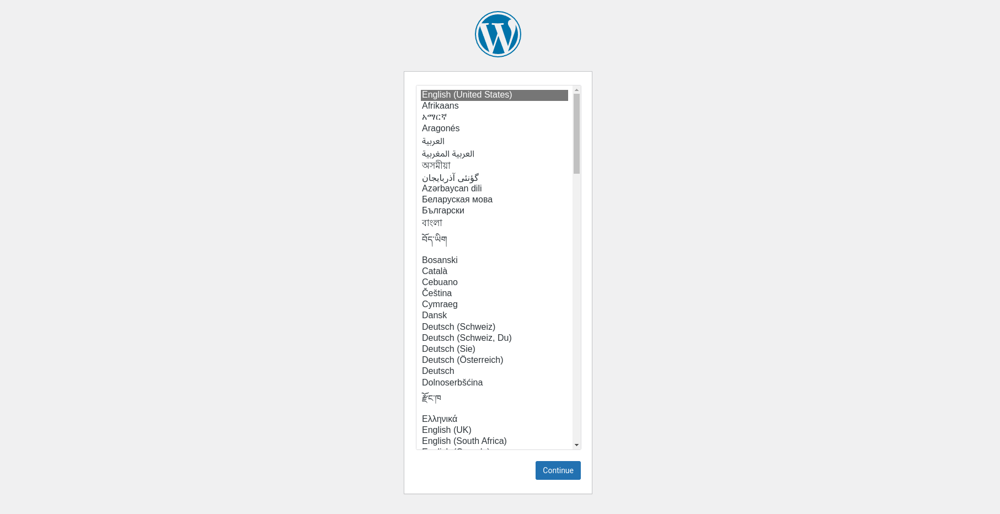

# Wordpress Company Profile Configuration

Repositori ini berisi file konfigurasi untuk menjalankan server Wordpress untuk profil perusahaan menggunakan Docker Compose. Server ini akan menjalankan Wordpress dengan beberapa pengaturan yang telah dikonfigurasi.

## Daftar Konten

- [Struktur Direktori](#struktur-direktori)
- [Cara Menggunakan](#cara-menggunakan)
  - [Prasyarat](#prasyarat)
  - [Menyesuaikan File Template](#menyesuaikan-file-template)
  - [Menjalankan Container Wordpress](#menjalankan-container-wordpress)
  - [Mengakses Wordpress](#mengakses-wordpress)
  - [Inisialisasi Database](#inisialisasi-database)
  - [Troubleshooting](#troubleshooting)
  - [Port yang Digunakan](#port-yang-digunakan)
    - [Langkah-langkah Membuka Port](#langkah-langkah-membuka-port)
      - [Di Docker Host](#di-docker-host)
      - [Di Google Cloud Platform (GCP)](#di-google-cloud-platform-gcp)
  - [Konfigurasi Dengan Ansible](#konfigurasi-dengan-ansible)
  - [Informasi Tambahan](#informasi-tambahan)
  - [Setelah Service Berjalan](#setelah-service-berjalan)

## Struktur Direktori

- `docker-compose.yml`: File Docker Compose utama yang digunakan untuk menjalankan container Wordpress.
- `docker-compose.yml.template`: Template file Docker Compose yang dapat disesuaikan dengan kebutuhan.
- `readme.md`: File dokumentasi ini.
- `image`: Direktori yang berisi gambar untuk dokumentasi.
    - `wp-logo.png`: Logo Wordpress.
    - `wp-web.png`: Screenshot Wordpress.

## Cara Menggunakan

### Prasyarat

Pastikan Anda telah menginstal Docker dan Docker Compose di sistem Anda. Jika belum, Anda dapat menginstalnya dengan mengikuti dokumentasi berikut:

- [Instalasi Docker](https://docs.docker.com/get-docker/)
- [Instalasi Docker Compose](https://docs.docker.com/compose/install/)

atau pada [Cara Instalasi Docker](../readme.md#instalasi-docker)

### Menyesuaikan File Template

Jika Anda ingin menyesuaikan konfigurasi, Anda dapat mengedit file `docker-compose.yml.template`. Gantilah placeholder dengan nilai yang sesuai:

```yaml
services:
  wordpress_web:
    image: wordpress:php8.3-apache
    restart: always
    ports:
      - 80:80
    environment:
      WORDPRESS_DB_HOST: ${WORDPRESS_DB_HOST} # IP address dari database server yang akan dihubungkan, bisa menggunakan IP internal atau eksternal jika sudah diatur (direkomendasikan menggunakan IP internal agar lebih aman dan cepat)
      WORDPRESS_DB_USER: databaseuser # username database yang akan digunakan oleh service ini
      WORDPRESS_DB_PASSWORD: ${WORDPRESS_DB_PASSWORD} # password database yang akan digunakan oleh service ini
      WORDPRESS_DB_NAME: wordpressweb # nama database yang akan digunakan oleh service ini
    volumes:
      - wordpress_web_data:/var/www/html

volumes:
  wordpress_web_data:
```

### Menjalankan Container Wordpress

1. **Kloning Repositori:**
   ```bash
   git clone https://github.com/SyahrulApr86/MITI-Configuration-files.git
   cd MITI-Configuration-files/Wordpress-Company-Profile
   ```

2. **Menjalankan Docker Compose:**
   Pastikan Anda berada di direktori yang berisi file `docker-compose.yml`, kemudian jalankan perintah berikut:
   ```bash
   sudo docker compose up -d
   ```

   Perintah ini akan mendownload image Wordpress (jika belum ada), membuat container, dan menjalankan Wordpress server dengan konfigurasi yang telah ditentukan.

### Mengakses Wordpress

Setelah container berjalan, Anda dapat mengakses Wordpress melalui browser menggunakan URL berikut:

- URL: `http://localhost`

Anda akan diarahkan ke halaman instalasi Wordpress. Ikuti langkah-langkah yang diberikan untuk menyelesaikan instalasi Wordpress.

### Inisialisasi Database

Database diinisialisasi menggunakan parameter yang ditentukan di file `docker-compose.yml`. Pastikan database yang ditentukan (`wordpressweb`) sudah ada dan dapat diakses oleh container Wordpress (Oleh karena itu, disarankan untuk menginstall server database terlebih dahulu).

### Troubleshooting

Jika Anda mengalami masalah saat menjalankan container, Anda dapat memeriksa log dengan perintah berikut:

```bash
sudo docker compose logs
```

Log ini akan memberikan informasi lebih lanjut tentang apa yang mungkin salah dan bagaimana cara memperbaikinya.

## Port yang Digunakan

Berdasarkan konfigurasi yang ada dalam file `docker-compose.yml`, hanya port 80 yang perlu dibuka. Port ini digunakan oleh Wordpress untuk komunikasi dengan klien web.

### Langkah-langkah Membuka Port

Anda bisa mengikuti langkah-langkah berikut untuk membuka port 80, atau Anda dapat melihat [Cara Membuat Firewall Rules](../readme.md#membuat-firewall-rules-di-gcp) jika menggunakan Google Cloud Platform.

#### Di Docker Host

Pastikan bahwa port 80 dibuka pada firewall di host Docker Anda sehingga klien dapat mengakses Wordpress server. Jika Anda menggunakan ufw pada Ubuntu, Anda dapat membuka port dengan perintah berikut:

```bash
sudo ufw allow 80/tcp
sudo ufw reload
```

#### Di Google Cloud Platform (GCP)

Jika Anda menjalankan instance di GCP, Anda perlu memastikan bahwa port 80 dibuka pada firewall rules GCP:

1. **Buka Google Cloud Console**.
2. **Navigasi ke VPC Network** > **Firewall**.
3. **Buat Firewall Rule Baru**:
    - Klik tombol **Create Firewall Rule**.
    - Masukkan detail berikut:
        - **Name**: `allow-http`
        - **Targets**: `Specified target tags` lalu beri nama tag `allow-http`
        - **Source IP ranges**: `0.0.0.0/0` (untuk akses publik) atau subnet spesifik.
        - **Protocols and ports**: Centang **Specified protocols and ports** dan masukkan `tcp:80`.
4. **Klik Create** untuk membuat firewall rule.
5. **Tambahkan Tag ke Instance**:
    - Navigasi ke **VM Instances**.
    - Klik instance yang ingin Anda akses.
    - Matikan instance jika sedang berjalan.
- Klik **Edit**.
- Pada bagian **Network tags**, tambahkan tag `allow-http`.
- Klik **Save** untuk menyimpan perubahan.

## Konfigurasi Dengan Ansible

Anda juga dapat menggunakan Ansible untuk mengelola konfigurasi Wordpress dan Docker (cara ini lebih sederhana). Anda dapat melihat cara menggunakannya di [Ansible Configuration](../Ansible/readme.md).

## Setelah Service Berjalan

Setelah service berjalan, Anda dapat mengakses Wordpress melalui browser menggunakan URL <ip_external>/wp-admin/install.php untuk mengatur Wordpress. Anda akan diarahkan ke halaman instalasi Wordpress. Ikuti langkah-langkah yang diberikan untuk menyelesaikan instalasi Wordpress. Selamat mencoba!



## Informasi Tambahan

Untuk informasi lebih lanjut tentang menggunakan dan mengkonfigurasi Wordpress di Docker, silakan merujuk ke dokumentasi resmi Wordpress dan Docker:

- [Dokumentasi Wordpress](https://wordpress.org/documentation/)
- [Dokumentasi Docker](https://docs.docker.com/)
