# MITIGAS Configuration File

Kelompok Mitigas:
- Griselda Neysa Sadiya - 2106751392
- Nazwa Allysa - 2206083672
- Rafael Bismo Dewandaru - 2206824666
- Syahrul Apriansyah - 2106708311


Repositori ini berisi file Docker Compose dan konfigurasi untuk berbagai layanan yang digunakan dalam organisasi e-commerce kami. Layanan tersebut mencakup situs profil perusahaan, platform e-commerce, file server, server database, alat pemantauan, dan server login SSO. Setiap layanan dikonfigurasi untuk berjalan pada instance terpisah di Google Cloud Platform (GCP).

## Daftar Konten

- [Ringkasan Proyek](#ringkasan-proyek)
- [Arsitektur](#arsitektur)
- [Prasyarat](#prasyarat)
- [Mengubah Kuota Alamat IP Statis](#mengubah-kuota-alamat-ip-statis)
- [Membuat Instance di GCP](#membuat-instance-di-gcp)
- [Membuat Aturan Firewall di GCP](#membuat-firewall-rules-di-gcp)
- [Struktur Direktori](#struktur-direktori)
- [SSH ke Instance](#ssh-ke-instance)
- [Instalasi Docker](#instalasi-docker)
- [Informasi Tambahan](#informasi-tambahan)


## Ringkasan Proyek

Organisasi menggunakan instance berikut:

- **Company Profile**: Instance untuk menampilkan halaman profil perusahaan dengan load balancing.
- **E-commerce**: Instance untuk menampilkan dan mengelola platform e-commerce dengan load balancing.
- **File Server**: Instance untuk berbagi dan menyimpan file antar anggota tim.
- **Database Server**: Instance untuk menyimpan dan mengelola database.
- **Monitoring**: Instance untuk memantau infrastruktur, termasuk fileserver, profil web, server database, dan e-commerce.
- **SSO Login Server**: Instance untuk mengelola single sign-on untuk berbagai layanan.

## Arsitektur

Arsitektur proyek ini terdiri dari beberapa instance yang berjalan di GCP. Setiap instance berisi layanan yang berbeda dan dikonfigurasi untuk berkomunikasi satu sama lain. Berikut adalah arsitektur proyek:


## Prasyarat

Sebelum memulai, pastikan Anda memiliki:

- Akses ke Google Cloud Platform dengan izin yang diperlukan
- Proyek yang telah disiapkan di GCP

## Mengubah Kuota "In-use IP Addresses" di GCP 

Sebelum membuat instance di GCP, pastikan Anda memiliki kuota "In-use IP addresses" yang cukup untuk proyek Anda. Jika kuota saat ini tidak mencukupi, Anda perlu meminta peningkatan kuota sebelum membuat instance baru. Untuk mengubah kuota alamat IP yang sedang digunakan menjadi 30 (sesuaikan dengan kebutuhan), ikuti langkah-langkah berikut menggunakan Google Cloud Console:

1. **Buka Halaman Kuota di Google Cloud Console:**
    - Kunjungi halaman [Quotas](https://console.cloud.google.com/iam-admin/quotas).

2. **Filter Kuota:**
    - Klik tombol filter (`filter_list`) untuk memfilter kuota berdasarkan properti spesifik.
    - Gunakan kotak pencarian Filter untuk mencari kuota "In-use IP addresses"

3. **Pilih Kuota "In-use IP addresses":**
    - Temukan kuota "In-use IP addresses" di kolom Quota.
    - Centang kotak di sebelah kuota tersebut.
    - Pastikan kuota yang dipilih sesuai dengan proyek Anda dan juga lokasi yang benar (sebagai contoh, us-central1).
   
       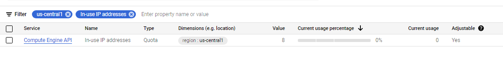

4. **Edit Kuota:**
    - Klik `create EDIT QUOTAS`.
    - Pada formulir perubahan kuota, masukkan nilai kuota baru yang Anda inginkan untuk proyek Anda di bidang New limit (contoh: 30).

5. **Kirim Permintaan:**
    - Lengkapi bidang tambahan pada formulir jika diperlukan.
    - Klik `DONE`.
    - Klik `SUBMIT REQUEST`.

Setelah langkah-langkah ini selesai, permintaan Anda untuk meningkatkan kuota akan diproses oleh Google Cloud.
    
- Jika permintaan Anda disetujui, Anda akan melihat kuota "In-use IP addresses" yang ditingkatkan di halaman Quotas.

    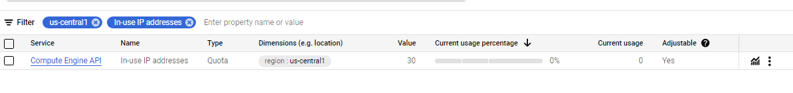

## Membuat Instance di GCP

Skrip berikut mengotomatisasi pembuatan instance yang diperlukan di GCP menggunakan perintah CLI. Simpan skrip ini sebagai `create_instances.sh` dan jalankan untuk membuat semua instance.

```bash
#!/bin/bash

PROJECT="mitigas-final"
ZONE="us-central1-c"
MACHINE_TYPE="e2-small"
IMAGE="projects/ubuntu-os-cloud/global/images/ubuntu-2004-focal-v20240515"
NETWORK_INTERFACE="network-tier=PREMIUM,stack-type=IPV4_ONLY,subnet=default"
DISK_TYPE="pd-balanced"
TAGS="http-server,https-server,lb-health-check"
SERVICE_ACCOUNT="534129012887-compute@developer.gserviceaccount.com"
SCOPES="https://www.googleapis.com/auth/devstorage.read_only,https://www.googleapis.com/auth/logging.write,https://www.googleapis.com/auth/monitoring.write,https://www.googleapis.com/auth/servicecontrol,https://www.googleapis.com/auth/service.management.readonly,https://www.googleapis.com/auth/trace.append"

create_instance() {
    gcloud compute instances create $1 \
        --project=$PROJECT \
        --zone=$ZONE \
        --machine-type=$MACHINE_TYPE \
        --network-interface=$NETWORK_INTERFACE \
        --maintenance-policy=MIGRATE \
        --provisioning-model=STANDARD \
        --service-account=$SERVICE_ACCOUNT \
        --scopes=$SCOPES \
        --tags=$TAGS \
        --create-disk=auto-delete=yes,boot=yes,device-name=$1,image=$IMAGE,mode=rw,size=10,type=projects/$PROJECT/zones/$ZONE/diskTypes/$DISK_TYPE \
        --no-shielded-secure-boot \
        --shielded-vtpm \
        --shielded-integrity-monitoring \
        --labels=goog-ec-src=vm_add-gcloud \
        --reservation-affinity=any
}

create_instance "company-profile-1"
create_instance "company-profile-2"
create_instance "db"
create_instance "ecommerce-1"
create_instance "ecommerce-2"
create_instance "fileserver"
create_instance "lb-company-profile"
create_instance "lb-ecommerce"
create_instance "ldap"
create_instance "monitoring-observium"
create_instance "monitoring-prome-grafana"
create_instance "monitoring-portainer"
```

### Cara Menggunakan

1. **Salin Skrip:**
    
    - Copy skrip `create_instances.sh` ke cloud shell.
   
      
   
    - Gunakan perintah untuk membuat direktori baru dan buka file `create_instances.sh`:
        ```bash
        mkdir "create_instances"
        cd create_instances
        nano create_instances.sh
        ```
   - Masukkan skrip di atas ke dalam file `create_instances.sh`.
    - Berikan izin eksekusi ke skrip:
      ```bash
      chmod +x create_instances.sh
      ```


2. **Buat Instance:**
    - Pastikan Anda telah menyiapkan proyek GCP Anda dan memiliki izin yang diperlukan.
    - Jalankan skrip `create_instances.sh` untuk membuat semua instance yang diperlukan:
      ```bash
      ./create_instances.sh
      ```
    - Tunggu hingga semua instance selesai dibuat.
   

3. **Konfigurasi Instance:**
    - Masuk ke dalam Compute Engine di menu sebalah kiri. Anda akan melihat semua instance yang baru dibuat.
    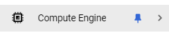
    - Konfigurasikan setiap instance sesuai kebutuhan Anda.
   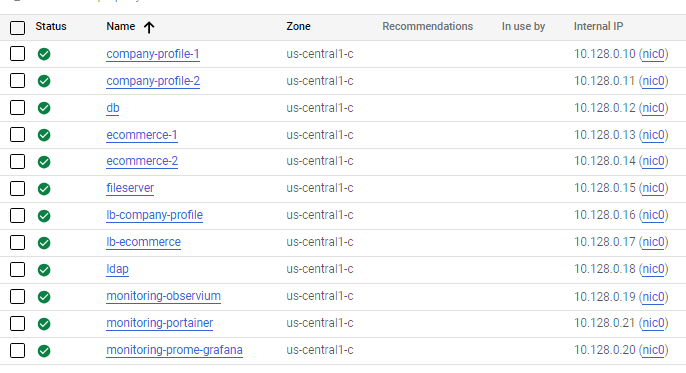

## Membuat Firewall Rules di GCP

Setelah membuat instance di GCP, pastikan Anda membuat aturan firewall yang diperlukan untuk mengizinkan lalu lintas ke instance Anda. Skrip berikut menunjukkan cara membuat aturan firewall menggunakan perintah CLI dengan membuka port sesuai yang dibutuhkan pada masing-masing service. Simpan skrip ini sebagai `create_firewall_rules.sh` dan jalankan untuk membuat aturan firewall yang diperlukan.

```bash
#!/bin/bash

# Allow SNMP
gcloud compute --project=mitigas-final firewall-rules create allow-snmp --direction=INGRESS --priority=1000 --network=default --action=ALLOW --rules=udp:161,udp:162 --source-ranges=0.0.0.0/0 --target-tags=allow-snmp

# Allow MySQL
gcloud compute --project=mitigas-final firewall-rules create allow-mysql --direction=INGRESS --priority=1000 --network=default --action=ALLOW --rules=tcp:3306 --source-ranges=0.0.0.0/0 --target-tags=allow-mysql

```

Kemudian jalankan skrip ini di Cloud Shell untuk membuat aturan firewall yang diperlukan.

```bash
chmod +x create_firewall_rules.sh
./create_firewall_rules.sh
```

## Struktur Direktori

- `Ansible`: File konfigurasi Ansible untuk mengotomatisasi berbagai tugas, salah satunya instalasi Docker di setiap instance.
- `Wordpress-Company-Profile`: File Docker Compose dan konfigurasi untuk instance profil perusahaan.
- `Wordpress-Ecommerce`: Platform e-commerce menggunakan WordPress.
- `LDAP`: File konfigurasi LDAP.
- `MySQL`: File konfigurasi database MySQL.
- `Nextcloud`: Pengaturan file server menggunakan Nextcloud.
- `NGINX-Company-Profile`: Nginx load balancer untuk profil perusahaan menggunakan WordPress.
- `NGINX-Ecommerce`: Nginx load balancer untuk platform e-commerce menggunakan WordPress.
- `Observium`: Pengaturan pemantauan menggunakan Observium.
- `Portainer`: Antarmuka manajemen Docker menggunakan Portainer.
- `Prometheus-Grafana`: Pengaturan pemantauan dengan Prometheus dan Grafana.

## SSH ke Instance

Untuk mengakses instance di GCP, Anda dapat menggunakan SSH melalui Google Cloud Console atau menggunakan terminal. 
1. **SSH melalui Google Cloud Console:**
    - Buka Google Cloud Console.
    - Pilih instance yang ingin Anda akses.
    - Klik tombol SSH di sebelah instance.
    
      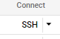
    - Anda akan masuk ke instance menggunakan SSH.
   
      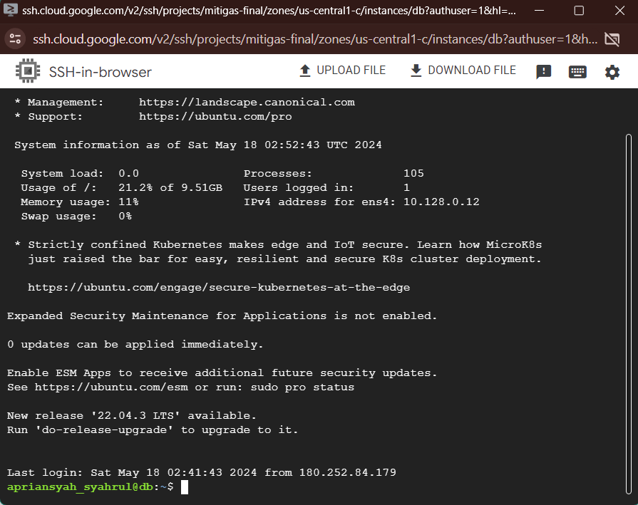

2. **SSH melalui Terminal:**
    - Buka terminal lokal Anda (PowerShell, Terminal, Bash, Zsh, dll.)
    - Siapkan nama berkas untuk kunci dan direktori tempat kunci tersebut disimpan. Kami merekomendasikan untuk menaruh pada direktori standar milik SSH, yaitu .ssh di direkotori $HOME atau jika menggunakan Windows, biasanya di C:\Users\[username]\.ssh. 
    - Jalankan perintah ssh-keygen sembari menspesi-fikasikan tipe dan nama kunci seperti berikut::
      ```bash
      ssh-keygen -t ed25519 -f [lokasi penyimpanan kunci]/[nama kunci]
      ```
      - Contoh:
        ```bash
        ssh-keygen -t ed25519 -f C:\Users\USER\.ssh\mitigas-key
        ```
    - Setelah perintahnya selesai dijalankan, Anda akan diberitahu lokasi penyimpanan dari kunci privat dan publik milik Anda.
   
      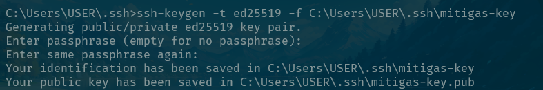
      - Catat:
        - Kunci publik (kunci dengan ekstensi .pub) bertujuan untuk disebarluaskan.
        - Kunci private (berkas tanpa ekstensi) merupakan kunci yang sebenarnya dan tidak untuk dibagikan kepada siapapun dalam kondisi apapun. 
    - “Cetak” berkas kunci publik (berkas dengan ekstensi .pub) menggunakan perintah berikut:
        ```bash
        cat [lokasi penyimpanan kunci]/[nama kunci].pub
        ```
      untuk windows ganti cat dengan type
        - Contoh:
            ```bash
            type C:\Users\USER\.ssh\mitigas-key.pub
            ```
        
          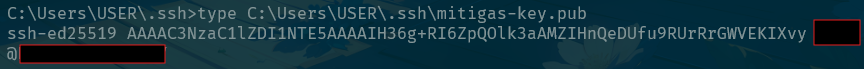
    - Untuk menjadikan kunci yang telah kita buat valid dengan tujuan menghubungkan perangkat lokal dengan mesin GCP kita, perlu dilakukan pendaftaran kunci SSH milik kita ke proyek GCP kita. Hal ini dapat diperoleh dengan memperbarui metadata dari layanan Google Compute Engine
    - Di dalam proyek Anda, klik tobol hamburger pada pojok kiri atas, hover menu “Compute Engine”, dan klik pada menu “Metadata”.
   
      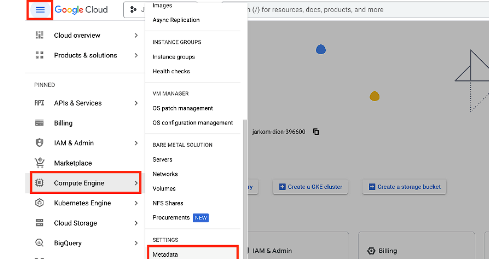
    - Navigasi ke menu SSH Keys dan klik tombol. “Add SSH Keys”.
   
      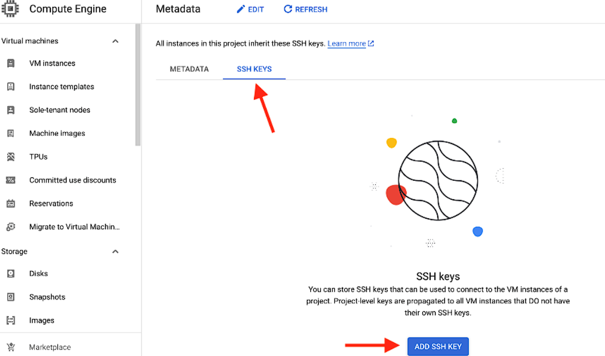
    - Salin kunci publik milik Anda, berikan spasi, dan masukkan email Anda dengan mengganti semua titik (.) menjadi underscore (_). Misal, jika email Anda john.doe@gmail.com, maka menjadi john_doe. Jika sudah, klik “Save” pada bagian bawah halaman.
   
      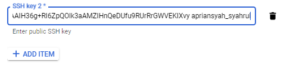
    - Sekarang, Anda dapat mengakses instance di GCP menggunakan SSH. Gunakan perintah berikut:
      ```bash
      ssh -i [lokasi penyimpanan kunci]/[nama kunci] [username]@[alamat ip instance]
      ```
      - Contoh:
        ```bash
        ssh -i C:\Users\USER\.ssh\mitigas-key apriansyah_syahrul@34.123.456.789
        ```
        
        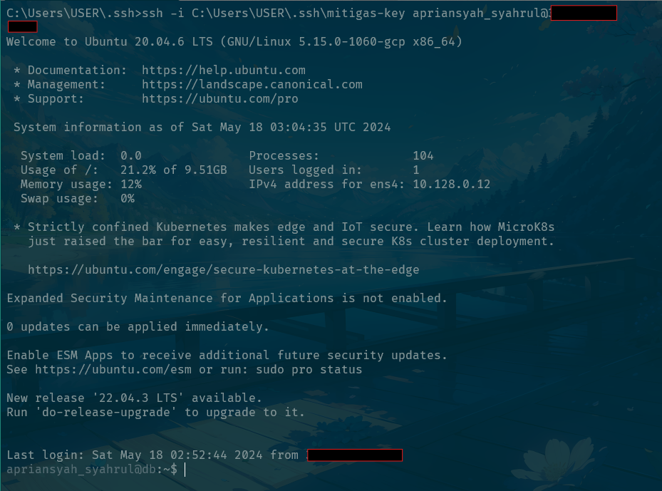


## Instalasi Docker

Untuk menjalankan layanan menggunakan Docker, pastikan Anda telah menginstal Docker di setiap instance. Berikut adalah langkah-langkah instalasi Docker (atau alternatifnya anda dapat menggunakan Ansible pada [Tutorial Install Menggunakan Ansible](Ansible/readme.md)):
- Masuk ke instance menggunakan SSH.
- Jalankan perintah berikut untuk menginstal Docker:
    ```bash
   sudo apt-get update
   sudo apt-get install ca-certificates curl
   sudo install -m 0755 -d /etc/apt/keyrings
   sudo curl -fsSL https://download.docker.com/linux/ubuntu/gpg -o /etc/apt/keyrings/docker.asc
   sudo chmod a+r /etc/apt/keyrings/docker.asc
   
   # Add the repository to Apt sources:
   echo \
   "deb [arch=$(dpkg --print-architecture) signed-by=/etc/apt/keyrings/docker.asc] https://download.docker.com/linux/ubuntu \
   $(. /etc/os-release && echo "$VERSION_CODENAME") stable" | \
   sudo tee /etc/apt/sources.list.d/docker.list > /dev/null
   sudo apt-get update
   
   sudo apt-get install docker-ce docker-ce-cli containerd.io docker-buildx-plugin docker-compose-plugin -y
    ```
  
## Menjalankan Layanan

Setelah Docker diinstal, Anda dapat menjalankan layanan menggunakan Docker Compose. Setiap direktori layanan berisi file Docker Compose dan konfigurasi yang diperlukan. Saran kami adalah untuk menjalankan layanan sesuai urutan berikut:
1. [Database Server (MySQL)](MySQL/readme.md)
   - Hal ini penting karena layanan lain seperti profil perusahaan dan platform e-commerce memerlukan database untuk berjalan.
2. [Company Profile](Wordpress-Company-Profile/readme.md), [E-commerce](Wordpress-Ecommerce/readme.md), [File Server (Nextcloud)](Nextcloud/readme.md)
   - Setelah database dijalankan, Anda dapat menjalankan layanan profil perusahaan, platform e-commerce, dan file server.
3. [Load Balancer](NGINX-Company-Profile/readme.md), [Load Balancer E-commerce](NGINX-Ecommerce/readme.md)
   - Load balancer diperlukan untuk mendistribusikan lalu lintas ke instance yang berbeda, dalam hal ini, profil perusahaan dan platform e-commerce.
4. [LDAP](LDAP/readme.md)
    - Layanan LDAP diperlukan untuk mengelola login SSO.
5. [Observium](Observium/readme.md), [Portainer](Portainer/readme.md), [Prometheus-Grafana](Prometheus-Grafana/readme.md)
   - Setelah layanan utama dijalankan, Anda dapat menjalankan layanan pemantauan dan manajemen.

## Informasi Tambahan

Untuk konfigurasi dan langkah-langkah setup yang lebih detail, lihat file README di setiap direktori. Pastikan semua layanan dikonfigurasi dengan benar dan berjalan sesuai harapan.

Jika Anda menghadapi masalah atau memiliki pertanyaan, silakan merujuk pada dokumentasi.

---
